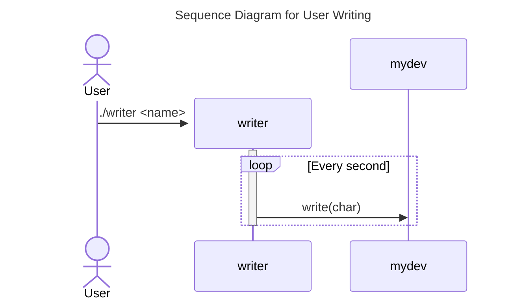
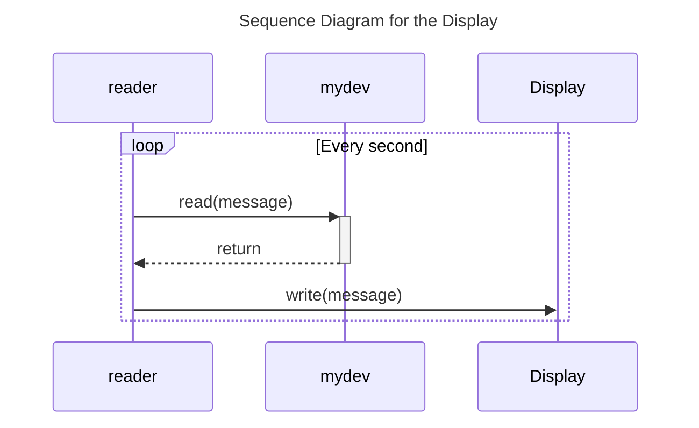

# Lab 4: Banner Using Sixteen-Segment Display

## Design and Implementation

Here is the whole story:

- A device is created as `/dev/mydev`.
- The user passes their name (a string) to the application `writer` .
- Every second, the application `writer` writers a character to the device.
- Every second, the application `reader` reads the message from the device and then writes it to the display.

### Writer

The [`writer`](./writer.c) application in lab 4 allows users to pass strings to it, and then it writes a character to the device every second. It is as simple as [`lab3-1_writer`](../lab3-1/lab3-1_writer.c), the writer in lab 3-1.

### Driver

The lab 4 driver [`mydev`](./mydev.c) provides an interface to read and write like the lab 3-1 driver [`lab3-1_driver`](../lab3-1/lab3-1_writer.c).

For each write operation, the driver gets the first character from user space by the `copy_from_user` function. Then, an array of characters is filled with `'0'` and `'1'` according to the written character. The `'0'` and `'1'` in the array respectively represent the off and on status of the corresponding segment of the segment display.

For each read operation, the driver copies the array of characters to user space by the `copy_to_user` function.

To show characters on the segment display, the [`reader`](./reader.c) application every second reads 16-byte data from the device and sends them to the virtual segment display controlled by [`seg.py`](./seg.py).

### Reader

The [`reader`](./reader.c) application in lab 4 reads the message from the device and writes it to the display every second.

### Display

The display is a virtual one run by [`seg.py`](./seg.py), which requires the `python3-tk` package to run it. The display can be run locally or remotely by setting proper IP.
