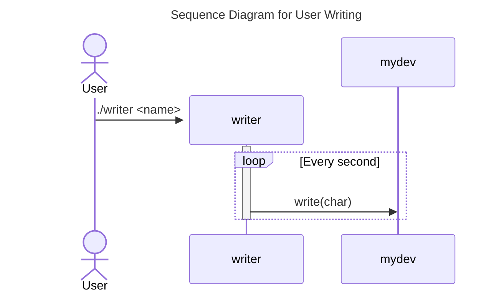
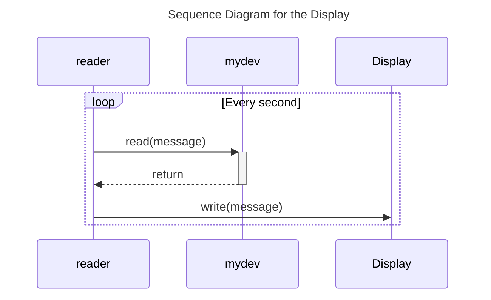

# Lab 4: Banner Using Sixteen-Segment Display

Here is the whole story:

- A device is created as `/dev/mydev`.
- The user passes their name (a string) to the application `writer` .
- Every second, the application `writer` writers a character to the device.
- Every second, the application `reader` reads the message from the device and then writes it to the display.





##

On the server, Python 3 with `tkinter` package is required to run `seg.py`. To install the required package on my WSL, I execute the following command:

```bash
​​​​sudo apt install python3-tk
```

On the client, which is the Raspberry Pi, the application `reader` reads messages from the device driver and pass messages to the server every second. 
