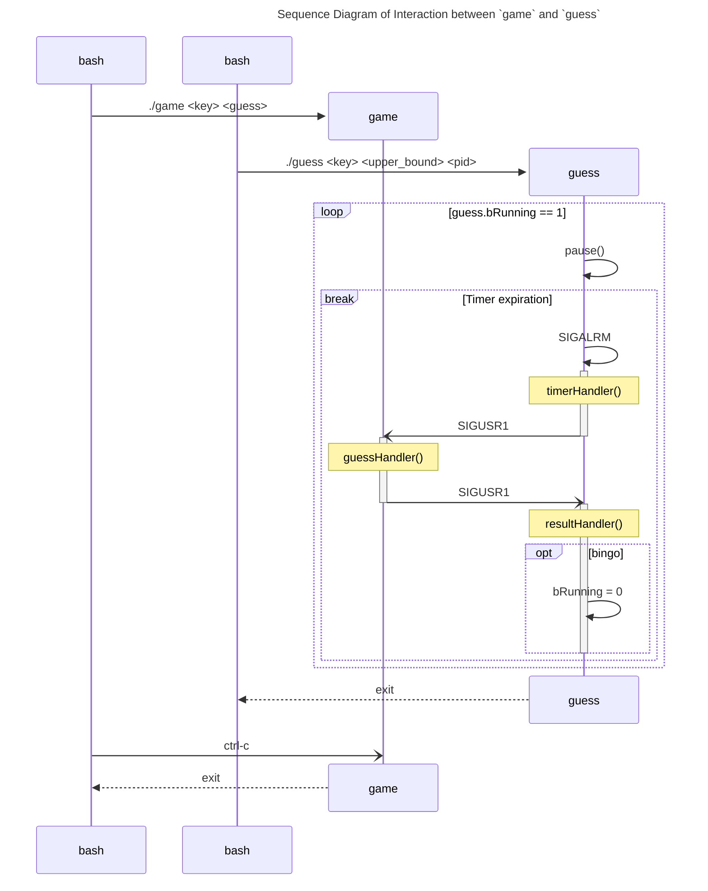

# Lab 7: Signal & Timer

In lab 7, students learn the usage of some signal and timer functions in C, and then apply the knowledge to implement a number guessing game.

## I. Introduction

The number guessing game consists of two programs, `guess` and `game`. The first program `guess` uses a timer to guess the number every second and uses a signal to notify the second program. The second program `game` will read in the guessed number and give three types of responses: "bingo", "bigger", and "smaller".

## II. Specification

The shared memory segment has the following structure:

```c
struct Data
{
    int guess;
    char result[8];
};
```

- The program `game`
    - creates a shared memory segment for the structure `Data`,
    - handles the guess by the program `guess` by a signal handler function, and
    - notifies `guess` of the result by sending the signal `SIGUSR1`.
- The program `guess`
    - gets the shared memory segment created by `game`,
    - guesses a number using binary search every second using a timer,
    - notifies `game` of the guess through the signal `SIGUSR1`, and
    - handles the results when receiving `SIGUSR1`.


